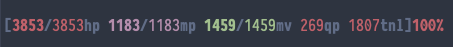

# TinTin++
This powerful MUD client is very easy to script for. This page is a collection of helper scripts to make your life easier.

## Table of Contents
- [Introduction](#introduction)
- [Prompts](#prompts)
- [Chat Logging](#chat-logging)
- [Idle Toggler](#idle-toggler)
- [Quest Buffer](#quest-buffer)
- [Mining Loop](#mining-loop)
- [Mining Repair Farm](#mining-repair-farm)
- [Mining Repair Loop](#mining-repair-loop)
- [Mining Smelting Loop](#mining-smelting-loop)
- [Armorsmith Fixing Loop](#armorsmith-fixing-loop)
- [Armorsmith Training Loop](#armorsmith-training-loop)
- [Armorsmith Crafting Loop](#armorsmith-crafting-loop)
- [Weaponsmith Fixing Loop](#weaponsmith-fixing-loop)
- [Weaponsmith Training Loop](#weaponsmith-training-loop)
- [Poison Training Loop](#poison-training-loop)
- [Disease Training Loop](#disease-training-loop)
- [Blind Training Loop](#blind-training-loop)

## Introduction
The most important aspect of tintin++ scripting is knowing `#help` and `#help <command>`, outside of that
it's recommended to keep different scripts in different files that way you can change the file, save it and
then reload it into the active AU session without having to exit/re-enter. 

In order to reload a file you merely `#read $filename`, if you removed different aliases or actions you may
have to remove them from active memory of tintin using the `#kill all` command and reload all the files
you require. In such cases, it makes the most sense to have a single tintin file that loads all other files
with `#read` commands so you only have to reload that one file that calls out to all the others like branches
of a tree.

Outside of that information, here are some basic helpful commands:
```
// log into au when tt++ opens automatically
#event {PROGRAM START} {#ses AdventuresUnlimited tharel.net 5005;y;####USERNAME####;####PASSWORD####;y}

// separate input from output
#split

// f1 and f2 hotkeys
#macro {\eOP} {take flask pocket;drink flask;drink flask;drink flask;drink flask;put flask pocket;}
#macro {\eOQ} {order ####PETNAME#### rescue ####USERNAME####}

// some basic aliases, this is for a quickling - hence `haste` and `slow`
#alias {sleep} {stand;take blanket pocket;drop blanket;r blanket;slow;sl}
#alias {wake} {rest;haste;stand;take blanket;put blanket pocket;l}
```
## Prompts

**Basic Prompt**



```
// next line is in-game command
prompt {D[{R%h{D/{r%Hhp {M%m{D/{m%Mmp {G%v{D/{g%Vmv {r%P{Dqp {r%X{Dtnl]{r%p {R%B%c

// next line is for tintin++ configuration of the same prompt
#prompt {[%1/%2hp %3/%4mp %5/%6mv %11qp %12tnl] %13} {<109>[<119>%1<109>/<019>%2<109>hp <159>%3<109>/<059>%4<109>mp <129>%5<109>/<029>%6<109>mv <019>%11<109>qp <019>%12<109>tnl]<119>%13<109>
```

**Monk Prompt**


```
// next line is in-game command
prompt {D[{R%h{D/{r%Hhp {M%m{D/{m%Mmp {G%v{D/{g%Vmv {c%Cchi {Y%q%Q{Dqt {y%l{Dql {r%P{Dqp {r%X{Dtnl]{r%p {R%B%c

// next line is for tintin++ configuration of the same prompt
#prompt {[%1/%2hp %3/%4mp %5/%6mv %7/%8chi %9qt %10ql %11qp %12tnl] %13 %14} {<109>[<119>%1<109>/<019>%2<109>hp <159>%3<109>/<059>%4<109>mp <129>%5<109>/<029>%6<109>mv <169>%7<109>/<069>%8<109>chi <139>%9<109>qt <039>%10<109>ql <019>%11<109>qp <019>%12<109>tnl] <119>%13<109> <119>%14}
```

**Multiline Prompt**


This is required to allow switches to go to tintin++.
```
prompt {D[{R%h{D/{r%Hhp {M%m{D/{m%Mmp {G%v{D/{g%Vmv {r%P{Dqp {r%X{Dtnl] {R[%p] [%B] [%t]%c
```
The next block is for tintin++ to configure. It's complex with if statements so we avoid `#prompt`
```
#split 0 2
#var {restedState}{none};
#var {petState}{none};
#action {[%1/%2hp %3/%4mp %5/%6mv %7qp %8tnl] [%9] [%10] [%11]} {
  #format {restedState}{%p}{%11};
  #format {petState}{%p}{%9};
  #if {"$petState" == ""}{ #var {petState}{<109>No pet}; };
  #else { #var {petState}{<109>Pet: <019>$petState}; };
  #if {"$restedState" == "You are well rested."}{ #var {restedState}{<129>$restedState}; };
  #if {"$restedState" == "You feel rested."}{ #var {restedState}{<149>$restedState}; };
  #if {"$restedState" == "You are a bit tired."}{ #var {restedState}{<169>$restedState}; };
  #if {"$restedState" == "You feel fatigued."}{ #var {restedState}{<159>$restedState}; };
  #if {"$restedState" == "You are tired."}{ #var {restedState}{<139>$restedState}; };
  #if {"$restedState" == "You are asleep on your feet!"}{ #var {restedState}{<119>$restedState}; };
  #showme {<109>[<119>%1<109>/<019>%2<109>hp <159>%3<109>/<059>%4<109>mp <129>%5<109>/<029>%6<109>mv <019>%7<109>qp <019>%8<109>tnl] $petState <119>%10}{-3};
  #showme {$restedState}{-2};
  #line gag;
}
```
## Chat Logging
You can log your chat to a separate file like this:
```
#action {[\s?\s]}{ #line log au.communications;#line gag; }
#action {^[{IC|Auction|Music|Question|Answer|OOC|Grats|TOT|Newbie|WAR|Clan}]}{ #line log au.communications;#line gag; }
#action {OOCly }{ #line log au.communications;#line gag; }
```
Then in another pane in tmux you can just tail your chat to keep it separate:
```
tail -f ./au.communications
```
## Idle Toggler
When idling it's usually best to make sure you're sleeping so you don't drop held items. Drinking from your flask is also a good idea. This toggler requires `drinkflask` macro and a file called `au.communications` you're using for a separate chat panel. You type `idle` to go afk and `noidle` to stop being idle. This will keep an `afk` flag on you while preventing your from logging out. It's usually more respectful to have the `afk` flag so others know when you are actually at the keyboard.
```
/* idle toggler */
#alias {idle}{
  #ticker {wholist}{board;who;stand;drinkflask;sleep;afk;}{120};
  #line log au.communications --idle start--;
  afk;
}
#alias {noidle}{
  #line log au.communications --idle end--;
  replay;
  #ticker {wholist}{ #nop; }{120};
}
```
## Quest Buffer
Here is a script that buffs your character right before a quest:
(you need to either add the 'buff' alias or replace it with commands for buffing delimited by semicolons)
```
#variable {readyForQuest} {true};
#action { 1qt }
{
  #if {{$readyForQuest}=={false}} {
    buff;
    #variable {readyForQuest} {true};
  }
}
#action { 0qt }
{
  #if {{$readyForQuest}=={true}} {
    #showme <138>+-----------------------+<088>;
    #showme <138>|    <178>Quest Available<138>    |<088>;
    #showme <138>+-----------------------+<088>;
    #variable {readyForQuest} {false};
  }
}
#action {You may now quest again.}
{
  #line gag;
}
```
## Mining Loop
There is no substitute for mining manually. Keep in mind that even though much of this is automated, you must continue to man the keyboard while this is ongoing or you are playing against the terms of service and will get in trouble. It merely makes your life easier and allows you to talk with others in the game and watch youtube instead of typing `mine` for the thousandth time. It's best to have a bunch of `clear potions` from heishaer in your `pocket` so as to `refresh` your waking state automatically during the process, the loop does this automatically if those exist. You can adjust the actions to remove the `score` trigger that uses `quaf clear` and replace it with `cast refresh` if you have the spell. Mining is hard work! This will continue to mine putting all xedalium into your pocket and donating everything else to the temple pit. If you have your rested state in your prompt then you can remove the `score` command as it will process automatically while you're mining.
```
/* mining loop - triggers only work when starting w/ td */
#var {tunnelDirection}{down}
#var {mining}{false}
#alias {tdd}{
  #var {mining}{false};
  autoexit;autobrief;automap;
  recall;
}
#alias {td}{
  #var {tunnelDirection}{down};
  #var {mining}{true};
  autoexit;autobrief;automap;
  order bob recall;
  tunnel $tunnelDirection;
}
#action {Underground Tunnel}{ #line gag; }
#action {You need to hold a pickaxe in order to dig}{
  hold pickaxe;
  #if {"$mining" == "true"}{
    tunnel $tunnelDirection;
    #showme <108>(tunneling);
    #line gag;
  };
}
#action {You feel rested.}{
  #if {"$mining" == "true"}{
    take clear pocket;quaf clear;
  };
}
#action {You are a bit tired.}{
  #if {"$mining" == "true"}{
    take clear pocket;quaf clear;
  };
}
#action {You feel fatigued.}{
  #if {"$mining" == "true"}{
    take clear pocket;quaf clear;
  };
}
#action {You are tired.}{
  #if {"$mining" == "true"}{
    take clear pocket;quaf clear;
  };
}
#action {You are asleep on your feet!}{
  #var {mining}{false};
  rr;sl;idle;
}
#action {You chip away at the walls making no progress}{
  score;
  tunnel $tunnelDirection;
  #showme <108>(tunneling-retry)
}
#action {You chip at the walls}{
  #if {"$mining" == "true"}{
    #var {tunnelDirection}{south};
    tunnel $tunnelDirection;
    #showme <108>(tunneling);
    #line gag;
  };
}
#action {You hammer at the tunnel walls with a steel pickaxe.}{ #line gag; }
#action {You chip away at the walls making very little progress}{
  #if {"$mining" == "true"}{
    tunnel $tunnelDirection;
    #showme <108>(tunneling-retry)
  };
  #line gag;
}
#action {It won't fit.}{
  #if {"$mining" == "true"}{
    donate chunk temple;
    drop chunk; /* if temple is full too */
  };
}
#action {You tunnel %1.}{
  #if {"$mining" == "true"}{
    $tunnelDirection;
    score; /* allow potential refresh via clear potion quaf */
    mine;
    #showme <108>(move %1);
    #line gag;
  };
}
#action {You chip off chunks of %1 from the vein.}{
  #if {"%1" == "xedalium"} {
    take chunk; put chunk pocket;mine;
    #showme <178>+------+ <168> Xedalium Chunk! <178>+------+;
    #line gag;
  };
  #else {
    tunnel $tunnelDirection;
    #showme <108>+------+ <048> %1 - Ignoring <108>+------+;
    #line gag;
  };
}
#action {You chip off part of the tunnel wall and find a %1 piece of %2.}{
  take %2;donate %2 temple;
  #showme <178>+------+ <158> %2 (%1)! <178>+------+;
  mine;
}
#action {You fail to mine the ore from the vein}{
  mine;
  #showme <108>(mining-retry);
  #line gag;
}
#action {You think there might be ore here but you do not see a vein to mine.}{
  mine;
  #showme <108>(mining-retry);
  #line gag;
}
#action {You search for a vein of metal in this tunnel but cannot locate one.}{
  tunnel $tunnelDirection;
  #showme <108>(tunneling);
  #line gag;
}
```
## Mining Repair Farm
Merely add this to the repair loop in order to allow it to automatically drop and destroy dark-trimmed floaters from Bose'nisten and pick them up automatically when farming them. Eventually you might thinking about short-cutting the repair loop if you have the ability to do so, it'll prevent needless usage of "rub" skill afer it's already mastered.
```
#action {A dark-trimmed %1 falls to the floor}{ take %1; }
#action {What mineral item do you wish to reform?}{ #var {minerRepairItem}{none}; }
#action {You cannot find scratches}{
  #if {"$minerRepairItem" != "none"}{ destroy $minerRepairItem; fm $minerRepairItem; };
}
#action {You cannot find any blemishes}{
  #if {"$minerRepairItem" != "none"}{ destroy $minerRepairItem; fm $minerRepairItem; };
}
```

## Mining Repair Loop
This will no longer interfere with other loops. We `clear` the activation variable after all of the repair items are done.
```
#var {minerRepairItem}{none}
#alias {fm %1}{ reform %1; #var {minerRepairItem}{%1}; }
#action {You slip with the hammer and}{ #if {"$minerRepairItem" != "none"}{reform $minerRepairItem;}; }
#action {You work with a hammer and anvil to improve the condition}{
  #if {"$minerRepairItem" != "none"}{ reform $minerRepairItem; };
}
#action {This item needs to be refined}{
  #if {"$minerRepairItem" != "none"}{ refine $minerRepairItem; };
}
#action {You slip with the steel wool and ding}{
  #if {"$minerRepairItem" != "none"}{ refine $minerRepairItem; };
}
#action {You refine the dings from}{
  #if {"$minerRepairItem" != "none"}{ refine $minerRepairItem; };
}
#action {This item needs to be rubbed}{
  #if {"$minerRepairItem" != "none"}{ rub $minerRepairItem; };
}
#action {You rub a scratch out of}{
  #if {"$minerRepairItem" != "none"}{ rub $minerRepairItem; };
}
#action {You fail to rub a scratch}{
  #if {"$minerRepairItem" != "none"}{ rub $minerRepairItem; };
}
```

## Mining Smelting Loop
This loop starts with `m <item to smelt, usually 2.xed> <size, usually 30. see required ore table>`.
It will smelt until the desired chunk size is acquired and then it will throw it in a dimensional pocket.
`note`: This may interfere with armorsmithing or weaponsmithing crafting loops.
```
/* smelting chunks loop */
#var {smeltingItem}{none};
#var {smeltingSize}{40};
#var {smeltingWeight}{0};
#alias {m %1 %2}{
  #var {smeltingItem}{%1};
  #var {smeltingSize}{%2};
  #showme <138>+------+ <188>Starting smelting $smeltingItem ($smeltingSize lb chunks)<138> +------+;
  smelt $smeltingItem;
}
#action {You combine your ore and now have %1 pounds of raw %2.}{
  #var {smeltingWeight}{%1};
  #if {$smeltingWeight < $smeltingSize}{ smelt $smeltingItem; };
  #if {$smeltingWeight >= $smeltingSize}{
    put %2 pocket;
    smelt $smeltingItem;
  }
}
#action {You now have %1 pounds of raw %2.}{
  #var {smeltingWeight}{%1};
  #if {$smeltingWeight < $smeltingSize}{ smelt $smeltingItem; };
  #if {$smeltingWeight >= $smeltingSize}{
    put %2 pocket;
    smelt $smeltingItem;
  }
}
```
## Armorsmith Fixing Loop
The following is an automated repair command for armorsmith. Merely type `f itemname` and it'll fix it provided you have a hammer and wool in your inventory.
```
#var {armorsmithRepairItem} {none}
#alias {f %1}{ #var {armorsmithRepairItem}{ %1 };rebuild $armorsmithRepairItem; }
#action {This item needs to be repaired}{ repair $armorsmithRepairItem; }
#action {This item needs to be readjusted}{ readjust $armorsmithRepairItem; }
#action {This item only needs to be readjusted}{ readjust $armorsmithRepairItem; }
#action {You succeed in removing a few blemishes}{ readjust $armorsmithRepairItem; }
#action {You fail to remove the blemishes}{ readjust $armorsmithRepairItem; }
#action {You work with a hammer and anvil to improve the condition}{ repair $armorsmithRepairItem; }
```
## Armorsmith Training Loop
The following is an automated armorsmith trainer. Merely get a bunch of `silver` items from `Mirage City` and then make sure you have a hammer, file and tongs in you inventory and type `m 2.silver` and it'll smelt everything down and make boots with nothing left over when finished. Because it's action-based you can still communicate over channels while it's running. Once you've mastered everything don't use this, use the automated crafting loop.
```
#var {armorsmithSmeltItem} {none};
#var {armorsmithFormItem}{feet};
#var {armorsmithOre}{unknown};
#var {armorsmithPoundMax}{100};
#var {armorsmithPoundCur}{0};
#action {You fail to smelt}{smelt $armorsmithSmeltItem; }
#alias {m %1}{ #var {armorsmithSmeltItem}{ %1 };smelt $armorsmithSmeltItem; }
#action {You combine your ore and now have %1 pounds of raw %2.}{
  #var {armorsmithOreWeight} { %1 };
  #if {$armorsmithOreWeight < 15}{ smelt $armorsmithSmeltItem; };
  #if {$armorsmithOreWeight > 14}{
    #var {armorsmithOre}{ %2 };
    hold tongs;form $armorsmithOre armor $armorsmithFormItem;
  }
}
#action {You now have %1 pounds of raw %2.}{
  #var {armorsmithOreWeight} { %1 };
  #if {$armorsmithOreWeight < 15}{ smelt $armorsmithSmeltItem; };
  #if {$armorsmithOreWeight > 14}{
    #var {armorsmithOre}{ %2 };
    hold tongs;form $armorsmithOre armor $armorsmithFormItem;
  }
}
#action {You fail to form} { smelt ruined; }
#action {You have broken the form} { smelt broken; }
#action {You have cracked the form} { smelt broken; }
#action {You filed a large gash into} { smelt $armorsmithSmeltItem; }
#action {You use your tongs and the anvil to form} {
  hold hammer;
  #var {armorsmithPoundCur} { 0 };
  pound $armorsmithFormItem;
}
#action {* CLANG! *} {
  #math {armorsmithPoundCur} {$armorsmithPoundCur + 1};
  #if {$armorsmithPoundCur < $armorsmithPoundMax} {
    hold hammer; pound $armorsmithFormItem;
  }
  #if {$armorsmithPoundCur == $armorsmithPoundMax} {
    hold tongs;quench $armorsmithFormItem;
  }
}
#action {You quench the form of the} { hold file; finish $armorsmithFormItem; }
#action {You file down} { smelt $armorsmithOre; }
```
## Armorsmith Crafting Loop
The following is a completely automated crafting loop. It smelts failures and automatically restarts until it made an item or you're out of resources. Make sure you you have a hammer, file and tongs in your inventory as well as items to smelt. `m (item name to smelt) (target equip slot) (target level)`:
```
/* smithing and smelting loop */
#var {armorsmithSmeltItem} {none};
#var {armorsmithFormItem}{feet};
#var {armorsmithOre}{unknown};
#var {armorsmithQuantity}{40};
#var {armorsmithPoundMax}{15};
#var {armorsmithPoundCur}{0};
#var {armorsmithForming}{false};
#var {armorsmithLevel}{105};
#alias {m %1 %2 %3}{
  #var {armorsmithSmeltItem}{ %1 };
  #var {armorsmithFormItem}{ %2 };
  #var {armorsmithLevel}{ %3 };
  #if {{%2}=={head}} { #var {armorsmithQuantity}{ 40 }; };
  #if {{%2}=={neck}} { #var {armorsmithQuantity}{ 30 }; };
  #if {{%2}=={arms}} { #var {armorsmithQuantity}{ 25 }; };
  #if {{%2}=={wrist}} { #var {armorsmithQuantity}{ 30 }; };
  #if {{%2}=={hands}} { #var {armorsmithQuantity}{ 25 }; };
  #if {{%2}=={torso}} { #var {armorsmithQuantity}{ 45 }; };
  #if {{%2}=={waist}} { #var {armorsmithQuantity}{ 40 }; };
  #if {{%2}=={legs}} { #var {armorsmithQuantity}{ 30 }; };
  #if {{%2}=={feet}} { #var {armorsmithQuantity}{ 15 }; };
  #if {{%2}=={hold}} { #var {armorsmithQuantity}{ 30 }; };
  #if {{%2}=={shield}} { #var {armorsmithQuantity}{ 30 }; };
  #showme <138>+------+ <188>Starting level $armorsmithLevel $armorsmithSmeltItem ($armorsmithQuantity ore)<138> +------+;
  smelt $armorsmithSmeltItem;
}
#action {You combine your ore and now have %1 pounds of raw %2.}{
  #var {armorsmithOreWeight} { %1 };
  #if {$armorsmithOreWeight < $armorsmithQuantity && "$armorsmithForming" != "true"}{ smelt $armorsmithSmeltItem; };
  #if {$armorsmithOreWeight >= $armorsmithQuantity}{
    #var {armorsmithOre}{ %2 };
    #var {armorsmithForming}{true};
    hold tongs;form '$armorsmithOre' armor $armorsmithFormItem;
  }
}
#action {You now have %1 pounds of raw %2.}{
  #var {armorsmithOreWeight} { %1 };
  #if {$armorsmithOreWeight < $armorsmithQuantity && "$armorsmithForming" != "true"}{ smelt $armorsmithSmeltItem; };
  #if {$armorsmithOreWeight >= $armorsmithQuantity}{
    #var {armorsmithOre}{ %2 };
    #var {armorsmithForming}{true};
    hold tongs;form '$armorsmithOre' armor $armorsmithFormItem;
  }
}
#action {You fail to form} { #var {armorsmithForming}{false}; smelt ruined; }
#action {You have broken the form} { #var {armorsmithForming}{false}; smelt broken; }
#action {You have cracked the form} { #var {armorsmithForming}{false}; smelt broken; }
#action {You filed a large gash into} { #var {armorsmithForming}{false}; smelt $armorsmithSmeltItem; }
#action {You use your tongs and the anvil to form} {
  #var {armorsmithPoundCur} { 0 };
  pound $armorsmithFormItem;
}
#action {* CLANG! *} {
  #math {armorsmithPoundCur} {$armorsmithPoundCur + 1};
  #if {$armorsmithPoundCur < $armorsmithPoundMax} {
    #showme <178>+------+ <188> Pounding <168>$armorsmithPoundCur<178>/<068>$armorsmithPoundMax <178>+------+;
    pound $armorsmithFormItem;
  }
  #if {$armorsmithPoundCur == $armorsmithPoundMax} {
    #showme <178>+------+ <188> Successful Pound! <178>+------+;
    hold tongs;quench $armorsmithFormItem;
  }
}
#action {You need a hammer to shape}{ hold hammer; pound $armorsmithFormItem; }
#action {You quench the form of the} { hold file; finish $armorsmithFormItem $armorsmithLevel; }
#action {You file down} {
  #var {armorsmithForming}{false};
  condition $armorsmithOre;
  #showme <138>+------+ <188>Finished $armorsmithFormItem<138> +------+;
}
```
## Weaponsmith Fixing Loop
Note that this may interfere with mining or armorsmith loops.
```
/* weaponsmith repair loop */
#var {weaponRepairItem}{none}
#alias {f %1}{ reconstruct %1; #var {weaponRepairItem}{%1}; }
#action {You work with a hammer and anvil to improve the condition}{ reconstruct $weaponRepairItem; }
#action {This item needs to be reconditioned}{ recondition $weaponRepairItem; }
#action {You slip with the hammer and miss}{ reconstruct $weaponRepairItem; }
#action {This item needs regular maintenance}{ maintain $weaponRepairItem; }
#action {You fail to remove the blemishes from}{ maintain $weaponRepairItem; }
#action {You remove a few blemishes from}{ maintain $weaponRepairItem; }

/* mirage weapon fix farming */
#var {weaponRepairCurrent}{none}
#alias {fw}{ f axe; #var {weaponRepairCurrent}{axe}; }
#action {What weapon did you wish to maintain?}{
  #if {"$weaponRepairCurrent" == "axe"}{
    #var {weaponRepairCurrent}{spear};
    f spear;
  };
  #elseif {"$weaponRepairCurrent" == "spear"}{
    #var {weaponRepairCurrent}{mace};
    f mace;
  };
  #elseif {"$weaponRepairCurrent" == "mace"}{
    #var {weaponRepairCurrent}{staff};
    f staff;
  };
  #elseif {"$weaponRepairCurrent" == "staff"}{
    #var {weaponRepairCurrent}{flail};
    f flail;
  };
  #else {
    #var {weaponRepairCurrent}{none};
    #showme <138>+------+ <188>Done Fixing Mirage<138> +------+;
  }
}

/* mirage weapon farming */
#action {       * a damaged flail}{ take flail corpse; }
#action {       * a small bronze spear}{ take spear corpse; }
#action {       * a steel mace}{ take mace corpse; }
#action {       * a bronze staff}{ take staff corpse; }
#action {       * a steel axe}{ take axe corpse; }
#action {       * a large broadsword}{ take broad corpse; }
```

## Weaponsmith Training Loop
The best way to start this loop is taking all your silver items from `mirage` from your pocket and then doing `m 2.silver`. Daggers are the best way to train weaponsmith even though they're 30lb of metal to craft. This will take a lot longer then armorsmith.
```
/* weaponsmith training loop */
#var {armorsmithSmeltItem} {none};
#var {armorsmithFormItem}{dagger};
#var {armorsmithOre}{unknown};
#var {armorsmithPoundMax}{100};
#var {armorsmithPoundCur}{0};
#action {You fail to smelt}{smelt $armorsmithSmeltItem; }
#alias {m %1}{ #var {armorsmithSmeltItem}{ %1 };smelt $armorsmithSmeltItem; }
#action {You combine your ore and now have %1 pounds of raw %2.}{
  #var {armorsmithOreWeight} { %1 };
  #if {$armorsmithOreWeight < 30}{ smelt $armorsmithSmeltItem; };
  #if {$armorsmithOreWeight > 29}{
    #var {armorsmithOre}{ %2 };
    hold tongs;form $armorsmithOre weapon $armorsmithFormItem;
  }
}
#action {You now have %1 pounds of raw %2.}{
  #var {armorsmithOreWeight} { %1 };
  #if {$armorsmithOreWeight < 30}{ smelt $armorsmithSmeltItem; };
  #if {$armorsmithOreWeight > 29}{
    #var {armorsmithOre}{ %2 };
    hold tongs;form $armorsmithOre weapon $armorsmithFormItem;
  }
}
#action {You fail to form} { smelt ruined; }
#action {You have broken the form} { smelt broken; }
#action {You have cracked the form} { smelt broken; }
#action {You filed a large gash into} { smelt $armorsmithSmeltItem; }
#action {You use your tongs and the anvil to form} {
  hold hammer;
  #var {armorsmithPoundCur} { 0 };
  hammer $armorsmithFormItem;
}
#action {* CLANG! *} {
  #math {armorsmithPoundCur} {$armorsmithPoundCur + 1};
  #if {$armorsmithPoundCur < $armorsmithPoundMax} {
    hold hammer; hammer $armorsmithFormItem;
  }
  #if {$armorsmithPoundCur == $armorsmithPoundMax} {
    hold tongs;quench $armorsmithFormItem;
  }
}
#action {You quench the form of the} { hold file; file $armorsmithFormItem; }
#action {You file down} { smelt $armorsmithOre; }
```
## Poison Training Loop
For classes that have 'cure poison' and 'poison', this is the fastest way to master both skills.
```
#var {farmState}{none};
#action {You feel less sick}{c 'poison' alleus;#var {farmState}{none};}
#action {You feel momentarily ill}{c 'poison' alleus;}
#action {The poison in you is resistant}{c 'cure poison';}
#action {You feel sick}{c 'cure poison' alleus;#var {farmState}{yes};}
#action {You lost your concentration}{
  #if {"$farmState"=="none"}{ c 'poison' alleus; }
  #if {"$farmState"=="yes"}{ c 'cure poison' alleus; }
}
```
## Disease Training Loop
For classes that have 'cure disease' and 'plague', this is the fastest way to master both skills.
```
#var {farmState}{none};
#action {Your sores vanish}{c 'plague' alleus;#var {farmState}{none};}
#action {You feel momentarily ill}{c 'plague' alleus;}
#action {The curse of the plague on you is resistant}{c 'cure disease';}
#action {You scream in agony as plague}{c 'cure disease' alleus;#var {farmState}{yes};}
#action {You lost your concentration}{
  #if {"$farmState"=="none"}{ c 'plague' alleus; }
  #if {"$farmState"=="yes"}{ c 'cure disease' alleus; }
}
```
## Blind Training Loop
For classes that have 'cure blind' and 'blind', this is the fastest way to master both skills.
```
#var {farmState}{none};
#action {You can see again.}{c 'blind' alleus;#var {farmState}{none};}
#action {The room seems darker.. then gets}{c 'blind' alleus;}
#action {The curse of blindness on you is resistant}{c 'cure blind';}
#action {You are blinded!}{c 'cure blind' alleus;#var {farmState}{yes};}
#action {You lost your concentration}{
  #if {"$farmState"=="none"}{ c 'blind' alleus; }
  #if {"$farmState"=="yes"}{ c 'cure blind' alleus; }
}
```
